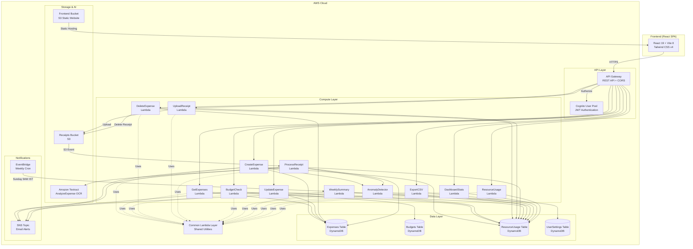

# SmartSpend — System Architecture

## Overview

SmartSpend is a **fully serverless** personal expense tracker built on AWS Free Tier. It uses an event-driven architecture where all components are managed services — no EC2 instances, no servers to maintain.

## Architecture Diagram



## Component Details

### Frontend
| Component | Technology | Purpose |
|-----------|-----------|---------|
| UI Framework | React 19 | Component-based SPA |
| Build Tool | Vite 8 | Fast HMR, code splitting |
| Styling | Tailwind CSS v4 | Utility-first, dark mode |
| Charts | Recharts | Pie, Area, Bar charts |
| Auth | amazon-cognito-identity-js | JWT-based authentication |
| HTTP | Axios | API calls with interceptors |
| Hosting | S3 Static Website | Public bucket with index.html |

### API Gateway
- **Type:** REST API (regional)
- **Auth:** Cognito User Pool Authorizer on all routes
- **CORS:** Enabled for all origins (`*`)
- **Binary:** Supports `text/csv` and `application/octet-stream`

### Lambda Functions (12 total)

| Function | Trigger | Purpose |
|----------|---------|---------|
| CreateExpense | POST /expenses | Create expense, auto-categorize, anomaly detection |
| GetExpenses | GET /expenses | List/filter/search/paginate expenses |
| UpdateExpense | PUT /expenses/{id} | Partial update with validation |
| DeleteExpense | DELETE /expenses/{id} | Delete expense + S3 receipt |
| UploadReceipt | POST /receipts/upload | Upload receipt image to S3 |
| ProcessReceipt | S3 ObjectCreated event | OCR via Textract → auto-create expense |
| BudgetCheck | GET/POST /budgets | Manage monthly category budgets |
| AnomalyDetector | Internal (Lambda invoke) | Statistical anomaly detection |
| WeeklySummary | EventBridge cron (Sundays) | Weekly spending digest via SNS |
| ExportCSV | GET /expenses/export | CSV export with date range |
| DashboardStats | GET /dashboard/stats | Aggregated monthly statistics |
| GetResourceUsage | GET /resources/usage | AWS resource consumption metrics |

### Shared Lambda Layer
All Lambda functions share a Common Layer containing:
- `db_utils.py` — DynamoDB CRUD helpers with pagination
- `response_utils.py` — Standardized API responses with CORS
- `auth_utils.py` — Cognito JWT token parsing
- `resource_tracker.py` — AWS resource usage logging
- `categorizer.py` — Rule-based expense categorization (keyword matching)
- `anomaly_utils.py` — Statistical anomaly detection + budget alerts
- `textract_parser.py` — Textract AnalyzeExpense response parser

### DynamoDB Tables

| Table | Partition Key | Sort Key | GSI | Purpose |
|-------|--------------|----------|-----|---------|
| SmartSpend-Expenses | userId (S) | expenseId (S) | date-index (userId + date) | Expense records |
| SmartSpend-Budgets | userId (S) | category (S) | — | Monthly budget limits |
| SmartSpend-ResourceUsage | service (S) | timestamp (S) | date-service-index | AWS usage tracking |
| SmartSpend-UserSettings | userId (S) | — | — | User preferences |

All tables use **PAY_PER_REQUEST** (on-demand) billing mode — no provisioned capacity needed.

### Data Flow: Expense Creation

```
User submits expense
  → API Gateway validates JWT
    → CreateExpense Lambda
      → Validate input
      → Auto-categorize (if no category)
      → Store in DynamoDB (amount in paise)
      → Check anomaly (statistical analysis)
      → Check budget threshold
      → Track resource usage
      → Return expense (amount in rupees)
```

### Data Flow: Receipt OCR

```
User uploads receipt image
  → UploadReceipt Lambda → S3 PutObject
    → S3 Event triggers ProcessReceipt Lambda
      → Amazon Textract AnalyzeExpense
      → Parse: merchant, amount, date, line items
      → Auto-categorize
      → Store expense in DynamoDB (source: receipt-ocr)
      → Check anomaly + budget
      → Track all resource usage
```

### Amount Handling
- **Internal storage:** Paise (integer) — avoids floating-point precision issues
- **API boundary:** Rupees (float) — amounts converted at response boundary only
- **Formula:** `amount_paise = int(round(amount_rupees * 100))`

### Security Model
- **Authentication:** Cognito JWT tokens (ID token in Authorization header)
- **Authorization:** Each user can only access their own data (userId from JWT)
- **S3 Receipts:** Pre-signed URLs (1-hour expiry) for secure access
- **IAM:** Least-privilege roles per Lambda (DynamoDBReadPolicy, DynamoDBCrudPolicy, etc.)
- **No secrets:** All configuration via environment variables from SAM template

### Resource Tracking
Every Lambda function logs its AWS resource consumption to the ResourceUsage DynamoDB table:
- Lambda invocations, duration, GB-seconds
- DynamoDB read/write capacity units
- S3 GET/PUT/DELETE operations
- Textract page processing
- SNS email publishes
- API Gateway calls

This data powers the **Resource Usage Dashboard** — the faculty-graded module demonstrating cloud billing awareness.
